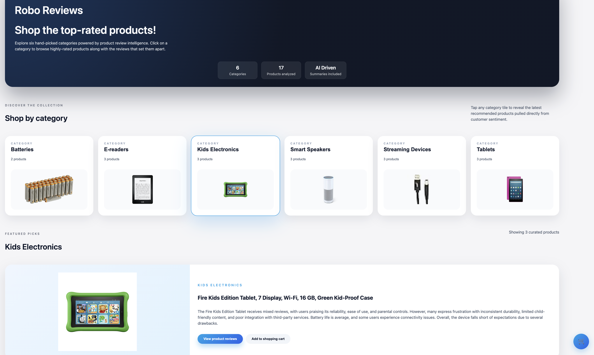

# RoboReviews — The product review aggregator

Product Review Aggregator powered by LLMs  

Demo: https://maleckicoa.com/demo-apps/robo-reviews   

   

##  Project Summary
Robo Reviews creates production ready content for a Product Review Website / Online Store. 
It takes a dataset of 65k+ raw user reviews and applies LLM based sentiment analysis, clustering and text generation 
in order to:
**1.** define product categories 
**2.** discover the best/worst products within each category 
**3.** generate a review summary for each product

Final product categories:
- Batteries
- E-readers
- Kids electronics
- Tablets
- Streaminging devices
- Smart speakers

## Project Structure
### src: 
- main.py - main project script, running this returns 2 .json files: (data/best_products.json, data/worst_products.json) 
These hold a selection of up to 3 best and worst rated product for each product group.
- data_prep.py - downloads and cleans the dataset ( https://www.kaggle.com/datasets/datafiniti/consumer-reviews-of-amazon-products/data )
- data_processing.py - Filters the dataset into a selection of best and worst rated products for each category
- model1.py - applies the sentiment analysis and assigns a 'positive', 'negative' or 'neutral' sentiment to each review
- model2.py - assigns a product category to each product review
- model3.py - Summarizes the product review for each of the top 3 best/worst products within each product category

### data:
- Contains generated pickle files that store intermediate model results. This also allows the models to be ran independently.

### photos 
- Photos of the categores/analysis used for defining the number of product categories

### dev_scripts
- Jupyter notebooks used during development
- See **dev_scripts/metrics.ipynb** for model 1 sentiment analysis metrics

##  How to run this project?
Run the **main.py**, it will sequentially run:
- data_prep.py       - data download and cleaning
- model1.py          - assigning of the sentiment
- model2.py          - assigning of the categories
- data_processing.py - selecting the best/worst products for each category and fetching the most representative reviews for each product
- model3.py          - generating a review sumary text (based on the reviews collected in previous step) for each of the best/worst products

Find the final output here: data/best_products.json, data/worst_products.json  
**data/best_products.json** contains the data behind the demo website: https://maleckicoa.com/demo-apps/robo-reviews

## Dataset
Consumer Reviews of Amazon Products 
https://www.kaggle.com/datasets/datafiniti/consumer-reviews-of-amazon-products/data 

## Models used

### Sentiment Analysis
cardiffnlp/twitter-roberta-base-sentiment-latest (https://huggingface.co/cardiffnlp/twitter-roberta-base-sentiment-latest)
Input: review title and full review text
Output: Positive, Neutral or Negative
Purpose: to measure user satisfaction per review

### Product Category Classification
gpt-4o-mini - used for product category classification:
Model Input: product title, review title and full review text for a batch (1000 from 60000) of reviews
Model Output: Six final product categories
Purpose: define a finite number of product categorries

text-embedding-3-small - text embedding model:
Model Input: product title, review title and full review text
Output: embedding vector
Purpose: Embedd each product review and 6 defined product categories. 
Later when using cosine similarty, each review will be assigned a product category

### Model 3 — Generative Article Summary with Llama
meta-llama/Llama-3.2-1B-Instruct (https://huggingface.co/meta-llama/Llama-3.2-1B-Instruct)
Model Input: Corpus of most representative 20 product reviews for each of the best/worst products
Model Output: A text summuary of the model input
Purpose: neutral summary of customer opinions for the best/worst products in each category.

## Requirements
- see pyproject.toml
